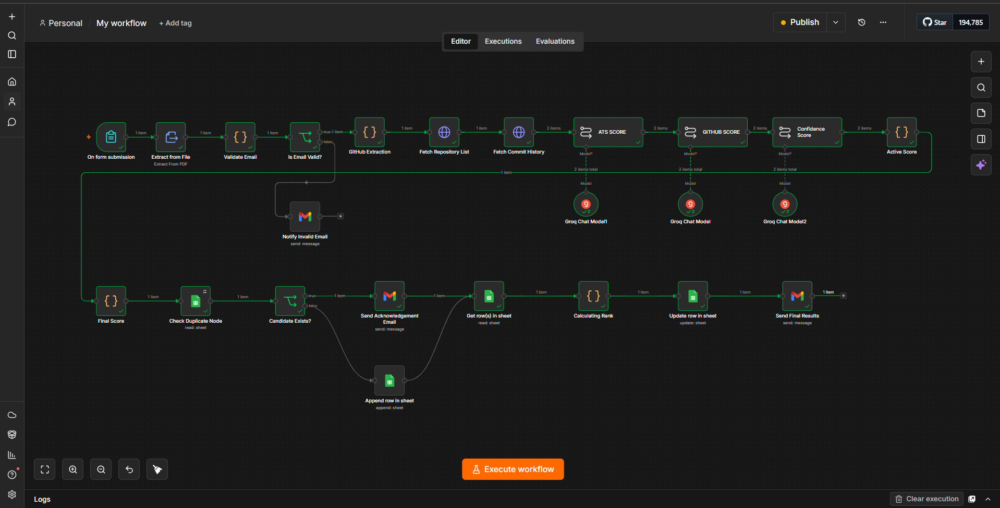
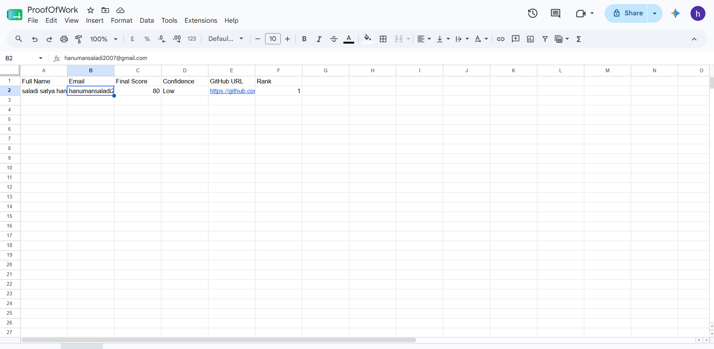
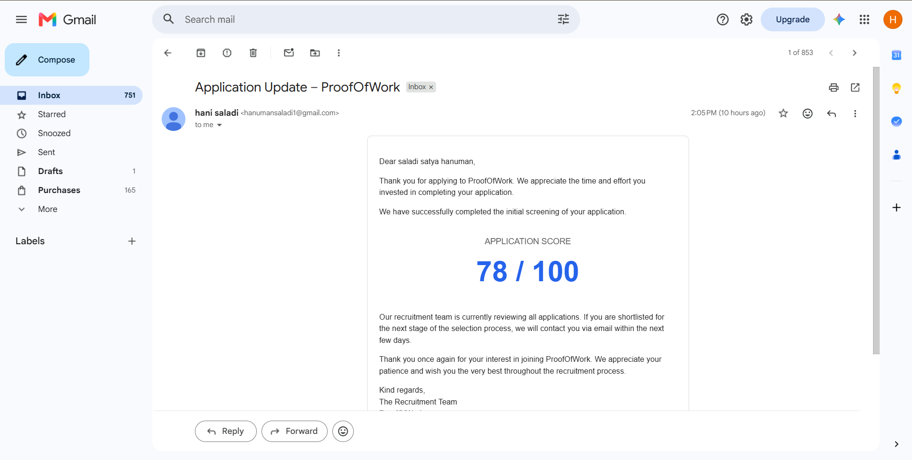

# 🤖 AI-Powered Resume & GitHub Screening System using n8n

An AI-powered recruitment automation workflow built with **n8n**, **Groq LLM**, **GitHub API**, **Google Sheets**, and **Gmail**.

This project automates the resume screening process by extracting information from resumes, validating candidate email addresses, analyzing GitHub repositories and commit history, generating AI-powered evaluation scores, detecting duplicate applications, ranking candidates, storing results in Google Sheets, and sending automated email notifications.

---

## 🚀 Features

- 📄 Extracts text from PDF resumes
- 📧 Validates candidate email addresses
- 👤 Extracts GitHub usernames from resumes
- 📂 Retrieves GitHub repositories using the GitHub API
- 📈 Analyzes GitHub commit history
- 🤖 Generates ATS Score using AI
- 💻 Generates GitHub Score using AI
- 🎯 Generates Confidence Score using AI
- 🏆 Calculates the Final Candidate Score
- 📊 Stores candidate information in Google Sheets
- 🔍 Detects duplicate candidate submissions
- 🥇 Calculates candidate rankings
- ✉️ Sends automated email notifications

---

## 🛠 Tech Stack

| Technology | Purpose |
|------------|---------|
| n8n | Workflow Automation |
| Groq LLM | AI-based Resume & GitHub Evaluation |
| GitHub API | Repository & Commit Analysis |
| Google Sheets API | Candidate Database |
| Gmail API | Automated Email Notifications |
| JavaScript | Custom Logic & Score Calculation |

---

## 📌 Workflow Overview

```text
Resume Submission
        │
        ▼
Extract Resume Text
        │
        ▼
Validate Email
        │
        ▼
Extract GitHub Username
        │
        ▼
Fetch GitHub Repositories
        │
        ▼
Fetch Commit History
        │
        ▼
ATS Score (AI)
        │
        ▼
GitHub Score (AI)
        │
        ▼
Confidence Score (AI)
        │
        ▼
Final Score Calculation
        │
        ▼
Check Duplicate Candidate
        │
   ┌────┴────┐
   │         │
Existing   New Candidate
   │         │
   └────┬────┘
        ▼
Update Google Sheets
        │
        ▼
Calculate Candidate Rank
        │
        ▼
Send Email Notification
```

---

## 📸 Project Screenshots

### 🖥️ Main n8n Workflow



---

### 📊 Google Sheets Output



---

### 📧 Email Validation



---

## 📂 Repository Structure

```text
AI-Powered-Resume-GitHub-Screening-System/
│
├── ai-resume-screening-workflow.json
├── README.md
└── images/
    ├── WORKFLOW.png
    ├── GOOGLE_SHEET.png
    └── EMAIL_CHECK.png
```

---

## ⚙️ Setup

### 1. Clone the repository

```bash
git clone https://github.com/hanumansaladi/AI-Powered-Resume-GitHub-Screening-System.git
```

### 2. Import the workflow

Import the `ai-resume-screening-workflow.json` file into your n8n instance.

### 3. Configure credentials

Configure the following credentials inside n8n:

- GitHub API
- Groq API
- Gmail
- Google Sheets

### 4. Update configuration

Update your API keys, Google Sheet IDs, and other required credentials.

### 5. Execute the workflow

Run the workflow and submit a resume to begin the automated screening process.

---

## 📚 Skills Demonstrated

- Workflow Automation
- AI Integration
- REST API Integration
- GitHub API
- Google Sheets Automation
- Email Automation
- JavaScript
- Prompt Engineering
- Resume Screening
- Candidate Evaluation

---

## 🎯 Future Improvements

- Support for multiple resume formats
- Recruiter Dashboard
- Candidate Analytics
- Multi-language Resume Analysis
- AI Interview Question Generator
- Resume Recommendation Engine

---

## 👨‍💻 Author

**Hanuman Saladi**

- GitHub: https://github.com/hanumansaladi
- LinkedIn: https://www.linkedin.com/in/hanuman-saladi-04815a322

---

⭐ If you found this project useful, consider giving it a star on GitHub!

---

## ⭐ Support

If you found this project helpful, consider giving it a ⭐ on GitHub!
